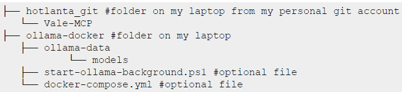
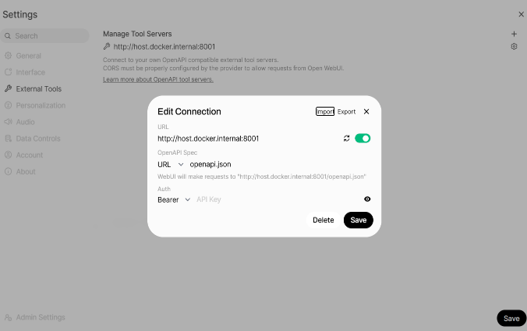
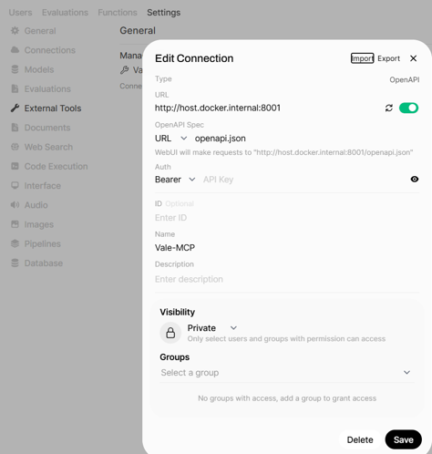
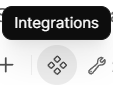
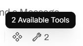

# Ollama / Open WebUI / Vale-MCP server how-to guide

## Core components and their roles

+--------------------+------------------------------------------------------------+
| **Component**      | **Role in the stack**                                      |
+====================+============================================================+
| Docker Desktop     | A one-click-install application that enables users to      |
|                    | **build, share, and run containerized applications and     |
|                    | microservices** on Mac, Linux, or Windows. It provides a   |
|                    | Graphical User Interface (GUI) to manage containers and    |
|                    | simplifies complex setups, including port mappings. It is  |
|                    | often the recommended way to install Open WebUI and        |
|                    | Ollama.                                                    |
+--------------------+------------------------------------------------------------+
| > Ollama           | The **LLM runner** responsible for serving the actual      |
|                    | large language models. Open WebUI connects to and manages  |
|                    | the Ollama instance.                                       |
+--------------------+------------------------------------------------------------+
| > Open WebUI       | The **user-facing, feature-rich, self-hosted web           |
|                    | interface** for interacting with LLMs. Architecturally, it |
|                    | is a web application that expects external tool            |
|                    | communication via **standard web protocols                 |
|                    | (HTTP/OpenAPI)**.                                          |
+--------------------+------------------------------------------------------------+
| > MCP Server       | > A **standardized application that exposes tools or       |
| > (Vale-MCP)       | > resources** (functions) to an AI model. Many local MCP   |
|                    | > servers are designed to communicate over **standard      |
|                    | > input/output (stdio)**. The **Vale-MCP Server**          |
|                    | > specifically integrates the Vale prose linting engine,   |
|                    | > enabling AI assistants to check files for style and      |
|                    | > grammar issues.                                          |
+--------------------+------------------------------------------------------------+
| > mcpo             | The **Critical Connector** that resolves the protocol      |
| > (MCP-to-OpenAPI) | mismatch between Open WebUI (HTTP/OpenAPI) and the MCP     |
| > proxy            | Server (stdio). It is a lightweight server that **wraps    |
|                    | the local MCP server command and exposes it as a standard  |
|                    | OpenAPI HTTP server**.                                     |
+--------------------+------------------------------------------------------------+
| > Vale             | > The underlying **prose linting engine** (tool) that      |
|                    | > performs style and grammar checks on text files. This    |
|                    | > tool is provided as a capability to the LLM via the      |
|                    | > Vale-MCP server.                                         |
+--------------------+------------------------------------------------------------+

## Multi-step install and configuration process

The integration requires foundational tools (Docker and Python) to be installed first, followed by running the core LLM stack (Ollama/Open WebUI) and finally setting up the MCP tool chain (Vale/Vale-MCP/mcpo).

**Note:** I followed this guide to setup a locally running AI with the Vale MCP server and adapted it for the Vale-MCP use case:
<https://skywork.ai/skypage/en/A-Deep-Dive-into-MCP-Servers-with-Open-WebUI-The-Complete-Guide-for-AI->Engineers/1971056632388448256

## Prerequisites

1.  **Install Docker Desktop:**
    [[https://www.docker.com/products/docker-desktop/]{.underline}](https://www.docker.com/products/docker-desktop/)

2.  **Install Python 3.11+:** <https://www.python.org/downloads/>

3.  **Install Python package manager** like pip or uv:

     uv example: `powershell -ExecutionPolicy ByPass -c \"irm https://astral.sh/uv/install.ps1> \| iex"`

### My file structure:

{width="7.135471347331584in" height="1.6041666666666667in"}

## Install the core LLM stack

1. **Install the bundled container**

Easiest method is using a single container image that bundles both Open WebUI and Ollama

For CPU Only: `docker run -d -p 8080:8080 -v open-webui:/app/data --name open-webui ghcr.io/open-webui/open-webui:ollama`

**Note:** I used 8080 to avoid conflicts with the port assigned to Docker Desktop (it was using port 3000)

2. **Run the container**

* In PowerShell, run -> `docker compose up --d`
  uses `docker-compose.yml` file which sets up both **Ollama** and **Open WebUI** cleanly on Windows 11 and makes both services persistent.

* alternative method which automates running the container:
  `cd D:\\ollama-docker #where my files are stored`
  `.\\start-ollama-background.ps1`

3.  **Access the interface**: Once running, Open WebUI is typically accessible at [http://localhost:8080](http://localhost:8080/)

4.  **Download LLM model**:
    `[[https://ollama.com/library]{.underline}](https://ollama.com/library)`

    for example: `docker exec -it ollama ollama pull llama3.1:8b`

**Note:** Docker-compose.yml and start-ollama-background.ps1 files can be found here: \Mondi-Tech\\Everyone - BSS\HPE MPC Common\\AI_tools\\*

## Install the MCP tooling chain (Vale, Vale-MCP, mcpo)

1. **Install Vale**

Install Vale CLI on your machine, typically with a package manger `choco install vale`

2. **Install Vale-MCP server**

Install Vale-MCP using the instructions found here:
[[https://github.com/ChrisChinchilla/Vale-MCP]{.underline}](https://github.com/ChrisChinchilla/Vale-MCP)
**Note:** I had to modify the package.json file to get it to install without errors

from `"build": "tsc && chmod 755 build/index.js",` to `"build": "tsc && node -e \"try{require('fs').chmodSync('build/index.js',0o755)}catch(e)}\"",`

3.  **Install the mcpo proxy**: `uv tool install mcpo` (to install it globally)

## Connect and run the Vale-MCP/mcpo service

**Start mcpo proxy server:**

In PowerShell, go to directory where Vale-MCP is saved and run the command (again be careful about which port is used):
`uvx mcpo --port 8001 -- vale-cli`

Example:
`D:\hotlanta_git\Vale-MCP> uvx mcpo --port 8001 -- vale-cli`

This command starts a web server on a designated port (for example, 8001) as a subprocess for incoming requests. The output should show the proxy running on an HTTP address such as [*http://0.0.0.0:8001*](http://0.0.0.0:8001)

## Configure the tool server in Open WebUI

The proxy's OpenAPI endpoint must be added to the Open WebUI interface.

In Open WebUI navigate to Settings -\> External Tools -\> Manage Tools Servers -\> Add Connection (+)

- Enter URL where Vale MCP server is running:
  [[http://host.docker.internal:8001]{.underline}](http://host.docker.internal:8001)
  (this URL is used since Open WebUI is containerizes while mcpo proxy runs on your laptop)

- {width="0.3542049431321085in"
  height="0.33337489063867015in"}Toggle on the connection

- Verify connection by clicking

{width="5.445095144356955in"
height="3.4166666666666665in"}

## Configure the tool server in Open WebUI (option 2)

In Open WebUI navigate to Settings Admin panel -\> Settings -\> External Tools -\> Manage Tool Servers -\> Add Connection (+)

- Enter URL where Vale MCP server is running:
  [[http://host.docker.internal:8001]{.underline}](http://host.docker.internal:8001/)

- Name [for connection]: Vale-MCP

- Toggle on the connection

{width="4.94086832895888in" height="5.178249125109361in"}

## Test the integration

1. **Activate the tool**

In the main chat window, choose which model to use from the drop-down box.

2. **Enable the tool**

At the bottom of the message box in the main chat window click Integrations -\> Tools and toggle on the newly configured tool (Vale MCP) {width="1.1772353455818023in" height="0.8855325896762904in"}

**Note** that the wrench button at the bottom of the message box shows available tools and the options for each tool. {width="1.7606594488188976in" height="0.8021894138232721in"}

3.  **Trigger a tool call**: Send a query to the LLM that requires the tool, such as "Use the tool_vale_status_post to check if Vale is installed."

4.  If successful, the LLM will respond with information supplied the local MCP server, confirming that the three core services (Open WebUI, mcpo, MCP server) are communication correctly.

## Available options for the Vale-MCP tool

## Example prompts

1.  Use the tool_vale_status_post to check if Vale is installed.

2.  Use tool_check_text_post to lint the following text: "Daboll and his first defensive coordinator, Wink Martindale, had a falling out and They parted ways after 2 years together."

3.  Use tool_check_file_post to lint the following file: `d:\hcltech_git\cms-techdocs-nwdaf\user_guide\decision_tables_c.dita`

4.  [Follow up to prompt to #3 since the model didn't provide the correct results for prompt #3] The file is a Dita file and I would like it checked against Vale style rules based on the Vale config file using tool_check_file_post similar to how you used tool_check_text_post

## Reference commands for using Docker containers

+-------------------------------+-------------------------------+
| > **Action**                  | **Command**                   |
+===============================+===============================+
| Start containers              | docker compose up -d          |
+-------------------------------+-------------------------------+
| Stop containers               | docker compose down           |
+-------------------------------+-------------------------------+
| View logs                     | docker compose logs -f        |
+-------------------------------+-------------------------------+
